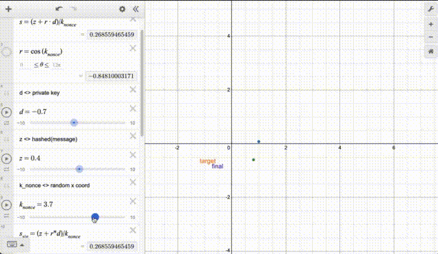
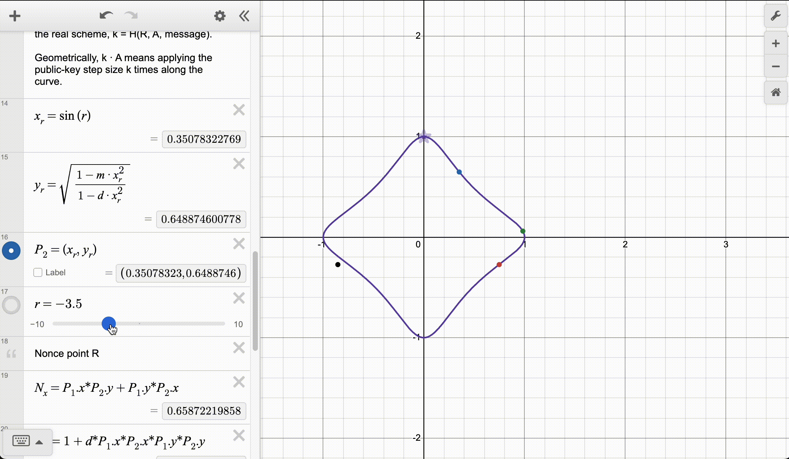

# ECC Cryptography & MPC Research Notes


## Part 0: Motivation, Scope, and Roadmap

Every blockchain transaction is, at its core, a math problem. You prove you own an address by producing a signature that only the holder of the corresponding private key could have produced. The network checks the math. If it passes, the transaction executes. If it doesn't, nothing happens. There is no password reset, no customer support line, no bank to call. The signature is the authorization, full stop.

This is not a general tutorial on elliptic curves, but it also does not assume you already speak ECC fluently. The background you need is small: private keys are scalars, public keys are curve points derived from those scalars, and signature schemes differ in how they combine secrets, nonces, and hashes. Part 1 introduces exactly that much machinery and no more.

The taxonomy also matters. There are three signature schemes in this story, not two. **ECDSA** and **Schnorr** are distinct constructions. **EdDSA** is best understood as a concrete Schnorr-family instantiation with specific choices for curve, hash, and nonce derivation. That distinction makes the rest of the note cohere: the MPC story is really "ECDSA versus Schnorr-style signatures," with EdDSA as the most important deployed Schnorr variant.

Bitcoin and Ethereum use ECDSA. Bitcoin Taproot uses Schnorr. Solana and Cardano use EdDSA. These are not arbitrary choices. Each scheme has different mathematical properties that determine whether you can build certain things on top of them — multi-sig aggregation, threshold custody, MPC wallets — without extraordinary complexity.

That is the roadmap of the note. Part 1 starts with a minimal ECC refresher, then walks through ECDSA, Schnorr, and EdDSA in that order. Part 2 shows why ECDSA MPC is hard, why Schnorr keeps reappearing inside those protocols, and why EdDSA inherits Schnorr's nice linearity while introducing its own nonce-coordination problem.

> **How to read this note:** If you only care why threshold ECDSA is painful, read Sections 1.1, 1.2, and 2.1. If you care why Schnorr/EdDSA threshold signing is cleaner, read Sections 1.2, 1.3, and 2.2. If you want the shortest version, jump to Section 2.3 and then come back for the details.

### Why These Schemes

This note focuses on ECDSA, Schnorr, and EdDSA for a narrow reason: they are the signature schemes that matter most to real-world threshold signing.

ECDSA matters because Bitcoin, Ethereum, and a large share of institutional custody infrastructure still depend on it. Schnorr matters because it is the clean algebraic alternative: once the signature equation becomes additive, threshold signing gets much simpler. EdDSA matters because it is the most important deployed Schnorr-family construction, so it shows what happens when clean algebra meets real implementation choices such as deterministic nonces.

This is not a survey of all digital signature schemes. It is a study of the ones that best explain why some MPC systems are painful, why others are elegant, and why modern custody stacks look the way they do.

### The Custody Problem

The core operational problem in institutional crypto is not storage. It is custody. A private key can control \$500M. If one machine, one employee, or one recovery procedure can produce a valid signature alone, then your entire security model collapses to that weakest point.

A hardware wallet is fine for an individual. For an exchange, custodian, or treasury operation, it is just a concentrated failure domain. One compromised device, one insider with enough access, one backup flow that looked reasonable on paper, and the funds are gone. Crypto has been relearning the same lesson for a decade: if control reduces to one key, operational mistakes become catastrophic.

**MPC threshold signing** changes the shape of the problem. There is still one logical signing key from the chain's point of view, but no single system ever possesses it outright. Signing power is distributed across $n$ parties, and any $t$ of them can jointly authorize a transaction. A compromised server yields one share, not the key. A rogue operator cannot move funds alone. A lost device is survivable as long as the threshold is still met.

That is the real appeal of threshold cryptography. It does not make key management disappear. It turns a brittle single-point-of-failure problem into a quorum problem. That is a much better trade.

This is why MPC matters in practice. It is not academic ornamentation around signatures. It is the cryptographic machinery that lets institutions keep large balances online without trusting any one machine or any one human being too much.

> The rest of this document explains the cryptographic machinery underneath: the minimal ECC background you need, how ECDSA, Schnorr, and EdDSA relate to each other, why their algebra makes MPC harder or easier, and what the leading protocol implementations actually do.


## Part 1: Signature Scheme Foundations

> This section exists for one reason: Part 2 is impossible to understand without it. It is not a full ECC course. It gives you just enough notation to read the equations, then compares ECDSA, Schnorr, and EdDSA in the order the MPC discussion depends on.

### 1.0 Minimal ECC Refresher

This note only needs four facts about elliptic-curve cryptography:

1. A **scalar** is a number modulo a large group order $n$.
2. A **point** is an element of the elliptic-curve group, and points can be added.
3. **Scalar multiplication** means repeated point addition: $a \cdot G$.
4. A public key is a point $Q = d \cdot G$ derived from a secret scalar $d$; going from $d$ to $Q$ is easy, recovering $d$ from $(G, Q)$ is assumed hard.

That is enough for this note. You do not need the full curve equation, coordinate systems, or point-addition formulas unless you are implementing the curve arithmetic itself.

### 1.1 ECDSA (Elliptic Curve Digital Signature Algorithm)

> **What to remember:** ECDSA looks manageable until the signing equation introduces $k^{-1}$. That one term is why threshold ECDSA becomes cryptographically expensive.

ECDSA is the default. Bitcoin used it. Ethereum uses it. Most blockchains deployed before 2020 use it. Understanding its signing equation is not optional. One term in that equation, the $k^{-1}$ inversion, is the root cause of everything hard about ECDSA MPC. We'll come back to that in Part 2.

If this is your first time seeing ECDSA notation, read symbols as follows: lowercase letters ($d, k, z, r, s$) are scalars (numbers mod $n$), uppercase letters ($G, Q, R$) are curve points, and $a \cdot G$ means scalar multiplication on the curve.

#### Notation (Quick Scan)

Curve constants:
- $G$: generator/base point (public constant)
- $n$: order of $G$ (scalar arithmetic is modulo $n$)

Keypair:
- $d$: private key scalar
- $Q = d \cdot G$: public key point

Per-signature quantities:
- $z = \text{hash}(msg)$: message digest scalar
- $k \in [1, n-1]$: fresh nonce scalar
- $R = k \cdot G$: nonce point
- $r = x(R)$: x-coordinate of the nonce point

Signature output:
- $(r, s)$: signature pair

#### Signing

$$s = k^{-1} \cdot (z + r \cdot d) \pmod{n}$$

Output signature: $(r,\ s)$

#### Derivation (Why verification works)

It's worth following the derivation carefully — it shows exactly what the verifier can reconstruct without learning the private key. Starting from the signing equation and solving for $k \cdot G$:

$$\begin{aligned}
k \cdot s &= z + r \cdot d \\
k &= \frac{z + r \cdot d}{s} \\
k \cdot G &= \frac{z}{s} \cdot G + \frac{r}{s} \cdot (d \cdot G) \\
&= \frac{z}{s} \cdot G + \frac{r}{s} \cdot Q
\end{aligned}$$

#### Verification

Given $(r, s, z, Q)$, the verifier reconstructs the random point:

$$R' = \frac{z}{s} \cdot G + \frac{r}{s} \cdot Q$$

Valid if $R'.x = r$.

The verifier never sees $k$ or $d$. They only see $r$, $s$, $z$, and $Q$. The math checks out anyway — that's the point.

#### Interactive Visualization

[click here to try it yourself](https://www.desmos.com/calculator/pxrkkhxcez)



This is not a literal secp256k1 plot. It is a visual proxy for the algebra.

The demo maps scalar relationships onto the unit circle via $T(t) = (\sin t, \cos t)$ so you can watch signing and verification move together in one frame. The only thing to notice is this: for a valid signature, the verifier reconstructs the same target implied by the signer's nonce. Change $k$ or $z$, and the downstream terms move with it.


### 1.2 Schnorr Signature

> **What to remember:** Schnorr fixes the part that hurts in ECDSA. The algebra stays additive from end to end.

Schnorr is simpler than ECDSA. Not because it's less secure — it's provably at least as secure under the same hardness assumptions — but because the math is additive throughout. There's no modular inversion anywhere in the signing equation. That single difference is why EdDSA MPC is tractable and ECDSA MPC usually needs extra secure-multiplication machinery such as Paillier- or OT-based MtA.

#### Notation (Quick Scan)

Curve constants:
- $G$: generator/base point (public constant)

Keypair:
- $a$: private key scalar
- $A = a \cdot G$: public key point

Per-signature quantities:
- $r$: random nonce scalar
- $R = r \cdot G$: nonce point
- $k = \text{hash}(R, A, msg)$: challenge scalar

Signature output:
- $(R, S)$ where $S = r + k \cdot a$

#### Signing

$$S = r + k \cdot a$$

Output signature: $(R,\ S)$

#### Derivation (Why verification works)

Multiply both sides by the base point $G$:

$$\begin{aligned}
S \cdot G &= r \cdot G + k \cdot (a \cdot G) \\
&= R + k \cdot A
\end{aligned}$$

#### Verification

Given $(R, S, A)$, the verifier computes $k = \text{hash}(R, A, msg)$ and checks:

$$S \cdot G = R + k \cdot A$$

No division. No inversion. Everything adds. The verifier recomputes $k$ from public information, multiplies, and checks equality. Keep this in mind when we get to MPC.


### 1.3 EdDSA (Edwards-curve Digital Signature Algorithm)

> **What to remember:** EdDSA is not a third totally unrelated idea. It is a concrete Schnorr-family design whose most consequential choice is deterministic nonce derivation.

EdDSA is Schnorr made concrete, standardized, and deployed at scale. Schnorr is an abstract framework: it specifies *how* to sign but leaves the curve, the hash, and the nonce derivation up to you. EdDSA answers all three questions and closes the door on implementation variation.

For readability, this section uses the schematic Schnorr-like form $S = r + k \cdot a$ and $S \cdot G = R + k \cdot A$. Actual RFC 8032 instantiations such as Ed25519 add hashing, encoding, and cofactor-handling details around that core algebra.

#### Notation (Quick Scan)

Curve constants:
- $G$: generator/base point (public constant)

Keypair:
- $a$: private key scalar
- $A = a \cdot G$: public key point

Per-signature quantities:
- $r = \text{hash}(\text{prefix} \| msg)$: deterministic nonce scalar (schematic RFC 8032 form)
- $R = r \cdot G$: nonce point
- $k = \text{hash}(R, A, msg)$: challenge scalar

Signature output:
- $(R, S)$ where $S = r + k \cdot a$

#### Interactive Visualization

[click here to try it yourself](https://www.desmos.com/calculator/mwnb018xh4)



This demo visualizes the schematic Ed25519 verification relation $S \cdot G = R + k \cdot A$.

The purple curve is a Twisted Edwards curve. The green point is the public key term $A$, the blue point is the nonce point $R$, the red point is $R + k \cdot A$, and the black point is the verification-side check $S \cdot G$.

In the demo, $k$ is fixed to $1$ for clarity. Drag the private scalar and nonce sliders to watch both sides move together. This is a geometric proxy, not literal Ed25519 field arithmetic.

EdDSA (designed by Bernstein et al.) is a concrete Schnorr-family signature design. It makes three concrete choices that abstract Schnorr leaves open:

| Aspect | Schnorr (abstract) | EdDSA (concrete) |
|--------|--------------------|-----------------|
| Curve | Unspecified | Twisted Edwards curve (e.g., edwards25519) |
| Hash | Unspecified | SHA-512 |
| Nonce | Unspecified | Deterministic from hashed secret material and the message |

The most widely used instantiation is **Ed25519** (EdDSA on edwards25519 with SHA-512). Solana uses Ed25519, which is part of why EdDSA matters in practice rather than only in theory.

The deterministic nonce is the most consequential design decision here. In ECDSA, if you reuse $k$ for two messages, an attacker can recover your private key with trivial arithmetic. EdDSA removes that failure mode by deriving $r$ from hashed secret material and the message. The same inputs produce the same nonce, so you do not have to trust your RNG.

This is a feature. It also becomes a specific problem in MPC, which we'll address in Section 2.2.


### 1.4 Comparison: ECDSA vs. Schnorr vs. EdDSA

The table below is the whole point of Part 1. Everything else in Part 2 follows from the "Linearity" row.

| Property | ECDSA | Schnorr | EdDSA |
|----------|-------|---------|-------|
| Signature equation | $s = k^{-1}(z + rd) \pmod{n}$ | $S = r + k \cdot a$ | $S = r + k \cdot a$ (same core algebra, plus EdDSA-specific details) |
| Linearity | Non-linear ($k^{-1}$ inversion) | Linear (additive) | Linear (additive) |
| Nonce type | Random | Random | Deterministic |
| Signature aggregation | Awkward | Much more natural | Much more natural |
| MPC complexity | High (needs extra secure-multiplication machinery) | Low (native additive sharing) | Low (native additive sharing) |
| Standardization | Bitcoin (legacy), Ethereum | Bitcoin (Taproot, BIP-340) | TLS, SSH, blockchain wallets |

If you're building MPC on ECDSA, you're fighting the $k^{-1}$ all the way down. If you're building on EdDSA, the math cooperates. Part 2 shows exactly what both of those look like.


## Part 2: MPC Applications

> **Reader's note:** this is the dense part. The main question is simple: which parts of the signing equation can parties compute locally, and which parts force extra cryptographic machinery?

Part 1 established the math. Part 2 asks the engineering question: how do you make multiple parties jointly compute a signature when no single party holds the complete key?

The answer depends heavily on the signature scheme. ECDSA makes this hard in a specific, painful way. Schnorr makes the algebra clean. EdDSA inherits that clean structure, but reintroduces complexity through deterministic nonce handling.


### 2.1 ECDSA MPC

> **What to remember:** Threshold ECDSA is hard for one reason: the signing equation forces parties to multiply secrets they do not want to reveal.

The details vary across Lindell 2017, GG20, and CGGMP21. The core problem does not. ECDSA introduces a multiplicative dependency that parties cannot evaluate locally, so every practical protocol has to work around that fact.


#### Phase 1: Distributed Key Generation (KeyGen)

This is the easy part — relatively speaking. Each party generates a random private key shard. Nobody sends their shard to anyone else. The joint public key is computed from the shards' public counterparts and is mathematically indistinguishable from a key generated on a single machine.

In the Lindell 2017 two-party construction used here as an explanatory lens, the shards are split **multiplicatively** ($x = x_1 \cdot x_2$), not additively. This feels counterintuitive. Additive splitting would be simpler. But in this construction ECDSA's signing formula requires computing $k^{-1}$, and modular inverses do not compose cleanly through a naive additive split. Other threshold ECDSA protocols use different share structures, but they run into the same core multiplication problem later.

$x_1$ and $x_2$ are generated by the respective parties $Q$, without any party learning the full private key $x = x_1 \cdot x_2$:

1. **Alice** generates random $x_1$, computes $Q_1 = x_1 \cdot G$.
2. **Bob** generates random $x_2$, computes $Q_2 = x_2 \cdot G$.
3. Joint public key: $Q = x_1 \cdot Q_2 = x_2 \cdot Q_1 = (x_1 \cdot x_2) \cdot G$.

#### Role of Schnorr: Proof of Knowledge (PoK)

Without this step, the protocol is broken in a specific way. If Alice just broadcasts $Q_1$ without proving she knows $x_1$, Bob could set $Q_2 = Q_{\text{target}} - Q_1$ for any address he wants to control. The joint key would be $Q_{\text{target}}$ — an address only Bob can sign for, because only Bob knows the corresponding scalar.

The fix is elegant: Alice must attach a Schnorr self-signature when she broadcasts $Q_1$. This proves she knows the discrete log of $Q_1$ without revealing $x_1$ itself. Bob verifies:

$$S \cdot G = R + k \cdot Q_1$$

This is a zero-knowledge proof that Alice knows the discrete log of $Q_1$.


#### Phase 2: Pre-Signing (Nonce Generation)

Same structure as KeyGen, applied to the signing nonce. Each party picks a random nonce shard, proves they know it (Schnorr PoK again), and the parties compute the aggregate point $R$ without reconstructing the full nonce scalar $k$.

The goal is to compute the nonce $k = k_1 \cdot k_2$ and the aggregate random point $R$ without any party learning the other's nonce shard:

1. **Alice** chooses random $k_1$, computes $R_1 = k_1 \cdot G$.
2. **Bob** chooses random $k_2$, computes $R_2 = k_2 \cdot G$.
3. Aggregate point: $R = k_1 \cdot R_2 = k_2 \cdot R_1 = (k_1 \cdot k_2) \cdot G$; extract $r = R.x$.
4. Schnorr PoK is used again to prove knowledge of each $k_i$.

> Here's the wall: the full signing formula is $s = k^{-1}(z + r \cdot d)$. Expand it with $k = k_1 \cdot k_2$ and $d = x_1 \cdot x_2$, and you get cross-terms like $k_1 \cdot x_2$ — a multiplication between secrets held by different parties. Neither party can compute this without revealing their value. That's the blocker.


#### Phase 3: MtA Protocol (Multiplicative-to-Additive Conversion)

Here's where the $k^{-1}$ finally bites. Expand the signing equation with the multiplicative shares from Phases 1 and 2:

$$s = k^{-1}(z + r \cdot d) \pmod{n}$$

With $k = k_1 \cdot k_2$ and $d = x_1 \cdot x_2$:

$$s = (k_1 k_2)^{-1}(z + r \cdot x_1 x_2)$$

If we denote $k_i^{-1}$ as $\gamma_i$:

$$s = \gamma_1 \gamma_2 \cdot z + r \cdot \gamma_1 x_2 \cdot \gamma_2 x_1$$

The terms $\gamma_1 x_2$ and $\gamma_2 x_1$ are the problem. They are cross-products: each mixes Alice's secret with Bob's secret. Neither side can compute them alone without revealing what it holds. That is the whole story. **ECDSA MPC is hard because ECDSA forces multiplication across secrets owned by different parties.**

Additive sharing fails here because multiplying additive shares produces:

$$(a_1 + a_2)(b_1 + b_2) = a_1 b_1 + a_1 b_2 + a_2 b_1 + a_2 b_2$$

The cross-terms $a_1 b_2$ and $a_2 b_1$ cannot be computed without one party revealing their value to the other.


**A Common Solution: Paillier Additive Homomorphic Encryption + MtA**

This is why practical ECDSA MPC protocols introduce MtA. The goal is not to do the whole signature under homomorphic encryption. It is just to convert a secret product into additive shares without revealing the multiplicands. This section uses the classical Paillier-based version because it is the easiest one to see.

Paillier is useful here because it is additively homomorphic:

$$\text{Enc}(a) \cdot \text{Enc}(b) = \text{Enc}(a + b) \qquad \text{(ciphertext multiplication = plaintext addition)}$$

$$\text{Enc}(a)^c = \text{Enc}(c \cdot a) \qquad \text{(ciphertext exponentiation = plaintext scaling)}$$

MtA uses that to turn a product $a \cdot b$ into additive shares $(\alpha, \beta)$ such that:

$$\alpha + \beta = a \cdot b \pmod{n}$$

In sketch form: Alice encrypts $a$, Bob homomorphically mixes in his secret $b$ and a random mask, and Alice decrypts a masked value that becomes her additive share. No one learns the other side's secret, but together they now hold shares of the product.

Once each cross-term is converted this way, the final signature becomes additive again:

$$s = \sigma_1 + \sigma_2 \pmod{n}$$

That works. It is also expensive: large Paillier keys, more communication, more proofs, more edge cases, more ways to get the protocol wrong. That is why one major ECDSA line of work evolves from Lindell 2017 through GG20 to CGGMP21/24: everyone is fighting the same non-linearity, then hardening the workaround.

### 2.2 EdDSA MPC

> **What to remember:** Threshold EdDSA is algebraically much cleaner than threshold ECDSA. The real complication is not the signature equation. It is nonce generation.

Because EdDSA inherits Schnorr's linearity, the MPC construction is structurally much simpler. However, one non-obvious challenge arises from EdDSA's deterministic nonce design.


#### Why EdDSA is Linearity-Friendly

This is the payoff from Section 1.2. Everything is additive. No Paillier. No MtA. No range proofs. The math just works.

Schnorr/EdDSA satisfies additive homomorphism across both keys and nonces:

$$\begin{aligned}
(a_1 + a_2) \cdot G &= a_1 \cdot G + a_2 \cdot G && \text{(key shares compose additively)} \\
(r_1 + r_2) \cdot G &= r_1 \cdot G + r_2 \cdot G && \text{(nonce shares compose additively)} \\
S_1 + S_2 &= S_{\text{total}} && \text{(partial signatures aggregate directly)}
\end{aligned}$$

No homomorphic encryption is needed — all operations are simply additions modulo the group order. Each party computes their partial signature locally. The coordinator sums them. That's it.


#### The Core Challenge: Deterministic Nonce Does Not Survive MPC

Standard single-device EdDSA (RFC 8032) derives the signing nonce deterministically:

$$r = \text{hash}(\text{prefix} \| msg), \qquad R = r \cdot G$$

On one machine, this is a feature. It removes RNG fragility and prevents catastrophic nonce reuse. In MPC, the complete secret material is never reconstructed anywhere. That is the whole point of threshold custody. So nobody can evaluate the standard deterministic nonce function directly.

This creates the main practical wrinkle in EdDSA MPC. The signature equation is linear, but the standard nonce derivation is not threshold-friendly. Real protocols replace single-device determinism with coordinated randomness: commit-and-reveal in simpler constructions, or FROST-style preprocessed nonces in faster ones.


#### Strategy A: Commit-and-Reveal

> **What to remember:** once deterministic nonce generation disappears, the first job is preventing anyone from choosing their nonce contribution after seeing everyone else's.

The first fix is simple: if parties must use fresh randomness, make sure nobody can wait, see everyone else's nonce point, and then choose theirs last.

| Step | Action |
|------|--------|
| 1. Commit | Each party samples $r_i$ and broadcasts a commitment to $R_i = r_i \cdot G$ |
| 2. Wait | Everyone collects all commitments |
| 3. Reveal | Each party reveals $R_i$ |
| 4. Verify | Check each reveal matches its earlier commitment |
| 5. Aggregate | Set $R = \sum_i R_i$ |

That removes the last-actor advantage. A stronger variant also attaches a Schnorr proof showing each party actually knows the discrete log behind the revealed $R_i$.

These are not the only ways to do it. They are the two that matter most for intuition: the simplest baseline, and the protocol family that won.


#### Strategy B: FROST

> **What to remember:** FROST keeps the nice Schnorr algebra, but moves nonce coordination into a more careful and more efficient protocol.

Commit-and-reveal works, but it costs an extra online round every time you sign. FROST moves most of that work offline. Parties pre-generate nonce material, publish commitments in advance, and then use a binding factor to tie each signer's nonce contribution to the full commitment list and the message.

Each signer has nonce commitments $(D_i, E_i)$ and computes:

$$\rho_i = \text{hash}\bigl(i,\ \{(D_j, E_j)\}_{j \in \text{signers}},\ msg\bigr)$$

$$R_i = D_i + \rho_i \cdot E_i, \qquad R = \sum_i R_i$$

The point is not the notation. The point is that nonce selection is now bound to the entire signing session, so an attacker cannot game the aggregate $R$ by choosing which preprocessed nonces to combine after seeing partial information.


> **Implementation note:** Ed25519 key derivation is itself non-linear (`seed -> hash -> clamp -> scalar`), so production MPC systems often distinguish between seed shares for backup/recovery and scalar shares for actual signing. This is real, but it is an implementation consequence of Ed25519 key derivation, not the main conceptual obstacle in threshold signing.


### 2.3 Bottom Line

The contrast is simple. ECDSA fights you at the algebra level, so threshold ECDSA needs heavy machinery just to evaluate the signing equation safely. Schnorr-style signatures cooperate algebraically, so threshold signing is much cleaner. EdDSA inherits that benefit, but gives back some complexity at the nonce layer because the standard deterministic construction does not survive distribution across parties.

That is why the modern protocol landscape looks the way it does. Threshold ECDSA commonly ends up in MtA- and proof-heavy constructions, often Paillier-based in the classical lineages leading to systems such as CGGMP. Threshold Schnorr is dominated by simpler designs such as FROST. Same custody problem. Very different cryptographic ergonomics.


## Appendix: Toy Threshold Schnorr Demo (Scalar-Only)

> **What to remember:** this appendix is here to make the additive structure intuitive, not to stand in for a real production EdDSA MPC implementation.

The point is simpler than the code usually makes it look. Once the signature equation is additive, threshold signing reduces to three moves: aggregate nonce points, compute partial signatures locally, then sum them.

```text
Each signer i holds:
  private share a_i
  fresh nonce share r_i

Each signer publishes:
  R_i = r_i * G

Coordinator aggregates:
  R = sum(R_i)
  k = H(R, A, msg)

Each signer returns:
  S_i = r_i + lambda_i * a_i * k

Coordinator aggregates:
  S = sum(S_i)

Verification:
  check S * G == R + k * A
```

That pseudocode is the whole intuition. The algebra closes cleanly because the scheme is additive. Real implementations add everything the toy version omits: real Edwards arithmetic, nonce commitments, FROST binding factors, share verification, malicious-party protections, and careful key derivation.

If you want the full toy implementation, link it separately rather than forcing it into the main reading flow.

---

## Appendix: References and Implementations

### Papers Worth Reading

[Lindell 2017 — Fast Secure Two-Party ECDSA Signing](https://eprint.iacr.org/2017/552)
The original practical 2-party ECDSA MPC construction. Introduced MtA with Paillier to handle cross-product terms. Still the clearest exposition of the core problem.

[CGGMP21 — UC Non-Interactive, Proactive, Threshold ECDSA with Identifiable Aborts](https://eprint.iacr.org/2021/060)
Canetti, Gennaro, Goldfeder, Makriyannis, Peled (2021). The current state of the art for threshold ECDSA. UC-secure, supports identifiable aborts, key refresh, and one-round online signing via presigning. The October 2024 revision (CGGMP24) adds explicit security checks that were missing from earlier versions — both synedrion and lfdt-cggmp21 implement this revision.

[FROST — Flexible Round-Optimized Schnorr Threshold Signatures](https://eprint.iacr.org/2020/852)
Komlo & Goldberg (2020). The standard threshold Schnorr construction. Early versions were vulnerable to Wagner's Attack / ROS; IETF required a mandatory two-round flow before ratifying the standard.

[IETF Draft — Two-Round Threshold Schnorr Signatures with FROST](https://datatracker.ietf.org/doc/draft-irtf-cfrg-frost/)
The ratified standard based on FROST.

---

### Production Libraries

[**Taurus multi-party-sig**](https://github.com/taurusgroup/multi-party-sig) — Go — CGGMP21, GG18, FROST
Audited by Kudelski Security. Coinbase identified a vulnerability in 2024; patched. [Advisory](https://github.com/advisories/GHSA-7f6p-phw2-8253).

[**lfdt-cggmp21**](https://github.com/LFDLFoundation/cggmp21) — Rust — CGGMP24
Linux Foundation Decentralized Trust (LFDT) / Lockness project. Production-ready, audited, with CRT and precomputed multi-exponentiation optimizations.

[**synedrion**](https://github.com/nucypher/synedrion) — Rust — CGGMP24
What this repo uses. Built on the manul protocol framework. AGPL-3.0. Implements KeyGen, Key Refresh, Presigning, Signing, Interactive Signing, and Key Resharing. Not yet audited — use in production at your own risk.
